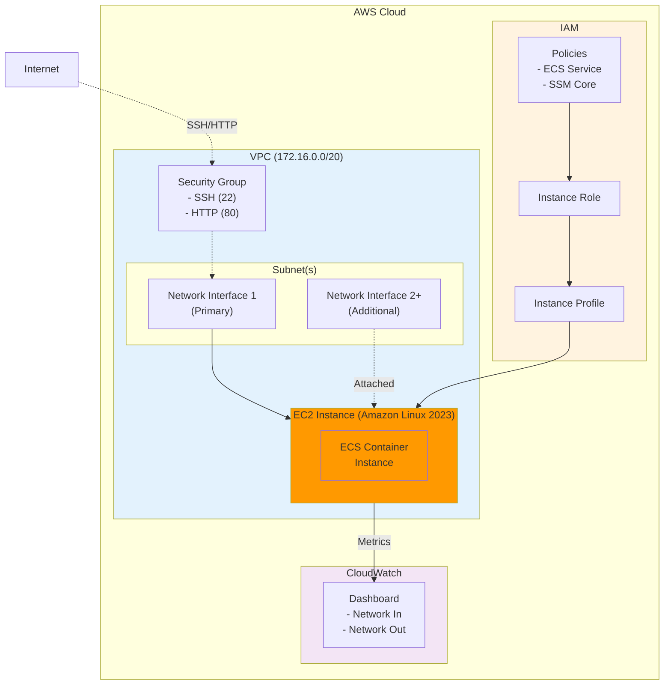

## Create ECS on EC2
> [!NOTE]
> Workflows -> [ecs.yaml](../../.github/workflows/ecs.yaml)

## Need setting

<details><summary>Structure</summary>



</details>

```yaml
- name: Terraform Apply
  run: terraform apply -auto-approve
  env:
    TF_VAR_ssh_key_name: "my-custom-key"
    TF_VAR_ssh_public_key: ${{ secrets.SSH_PUBLIC_KEY }}
```